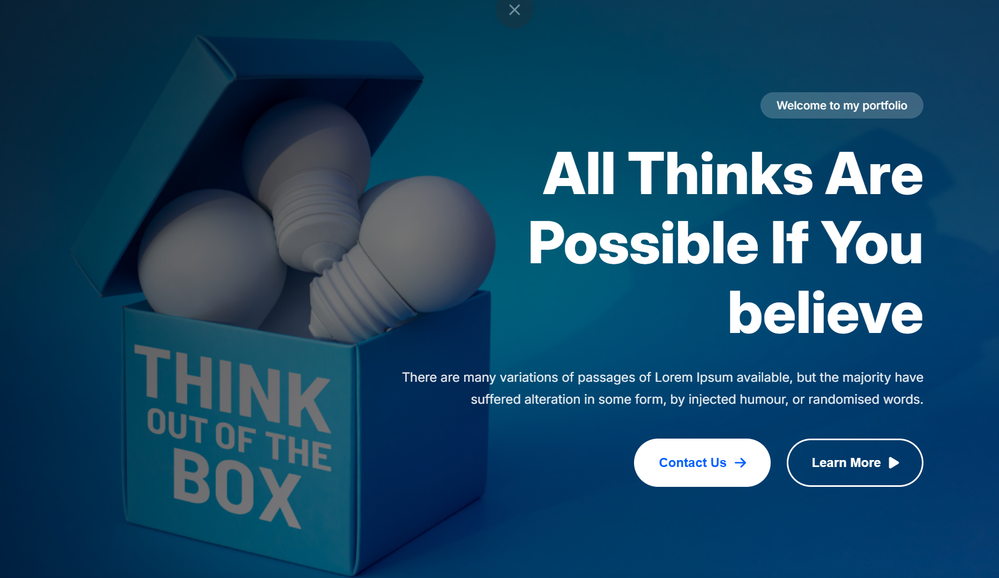

<div align="center">

# 🌟 Believe & Achieve — Professional Portfolio

### 🚀 A Modern Personal Portfolio Website

[](https://munna-asn-one.vercel.app)
[]
[]
[]

A clean, responsive, and modern portfolio showcasing professional growth, goals, and achievements.

</div>

---

## 📸 Preview

<p align="center">
  
</p>

---

## 🌐 Live Website

👉 https://munna-asn-one.vercel.app

---

## ✨ Features

✅ Modern & Minimal UI Design  
✅ Fully Responsive (Mobile → Desktop)  
✅ Interactive Navigation System  
✅ Smooth Scroll Animations (AOS)  
✅ Animated Achievement Counters  
✅ Newsletter Subscription with Validation  
✅ Smart Back-To-Top Button  
✅ Smooth Section Navigation  
✅ Optimized Performance & Clean Structure

---

## 🛠️ Tech Stack

| Technology               | Purpose                 |
| ------------------------ | ----------------------- |
| **HTML5**                | Semantic page structure |
| **Tailwind CSS**         | Utility-first styling   |
| **JavaScript (Vanilla)** | Interactivity           |
| **AOS Library**          | Scroll animations       |
| **Font Awesome**         | Icons                   |
| **Google Fonts (Inter)** | Typography              |

---

## 📂 Project Structure

portfolio/
├── index.html # Main website file  
├── styles/  
│ └── style.css # Custom styling  
├── js/  
│ └── main.js # Interactive functionality  
├── images/ # Website assets  
├── favicon/ # Browser icons  
└── README.md # Project documentation

---

## 🚀 Website Sections

### 🏠 Home

Hero section with strong introduction and call-to-action buttons.

### 👤 About

Personal journey, failures, lessons learned, and animated statistics.

### 🎯 Plans

Future goals and professional aspirations.

### 🖼️ Gallery

Image & video previews with dropdown navigation.

### 📬 Contact

Footer with social media links and newsletter subscription.

---

## 💻 Local Development

### 1️⃣ Clone Repository

```bash
git clone https://github.com/muntasir-smm/munna-assignment-one
```

### 2️⃣ Enter Project Folder

```bash
cd portfolio
```

### 3️⃣ Run Project

Open **index.html** directly in your browser  
or use **Live Server** in VS Code.

---

## 📱 Responsive Breakpoints

| Device  | Width         |
| ------- | ------------- |
| Mobile  | < 640px       |
| Tablet  | 640px – 768px |
| Desktop | > 768px       |

---

## 🔧 Customization Guide

- Edit content inside `index.html`
- Change colors via Tailwind utility classes
- Modify animations in `js/main.js`
- Update social links in footer section
- Replace images inside `/images` folder

---

## 📧 Contact

- 📩 Email: **munna112ru@gmail.com**
- 👍 Facebook: **@muntasir.smm**
- 📸 Instagram: **@muntasir_smm**
- 💻 GitHub: **@muntasir-smm**

---

## 🤝 Contributions

Contributions, suggestions, and feedback are welcome!

1. Fork the repository
2. Create a feature branch
3. Commit changes
4. Open a Pull Request

---

## 📄 License

© 2024 **Muntasir SMM** — All Rights Reserved.

---

<div align="center">

### ⭐ If you like this project, give it a star on GitHub!

Designed with ❤️ for excellence

</div>
